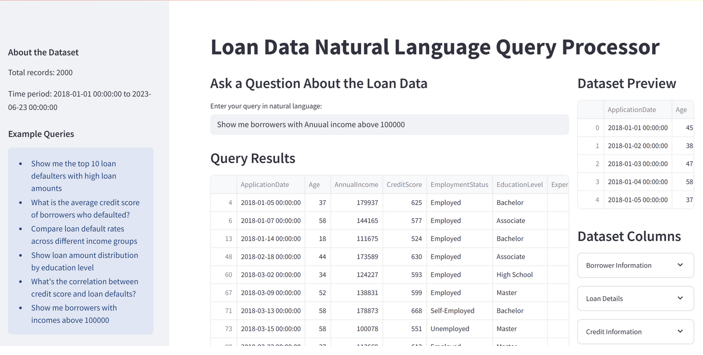

# Loan Approval Prediction System

End-to-end ML classification system with NLP-based querying and Streamlit deployment


---

## Problem Statement

Financial institutions face significant losses due to loan defaults. This project builds a complete machine learning system to predict whether a loan application will be approved enabling lenders to make smarter, data-driven credit decisions. A key feature is an NLP-based query interface that allows non-technical users to interrogate the loan dataset using plain English.

---

## Project Highlights

- Ingested and stored 2,000+ loan records in MongoDB with an optimised schema for efficient querying
- Built and compared 3 ML models — Logistic Regression, Decision Tree, and Random Forest
- Achieved 85% accuracy, 82% precision, and 80% recall with Random Forest
- Developed an NLP-based Natural Language Query Processor using spaCy and NLTK
- Deployed an interactive Streamlit app with real-time sliders for live loan approval prediction

---

## Tech Stack

| Category | Tools |
|---|---|
| Language | Python |
| Database | MongoDB |
| Data Processing | Pandas, NumPy |
| Visualisation | Matplotlib, Seaborn, Plotly |
| Machine Learning | Scikit-learn |
| NLP | spaCy, NLTK |
| Deployment | Streamlit |

---

## Project Structure
├── PBL_Main.ipynb          # Main notebook — EDA, modelling, evaluation
├── app.py                  # Streamlit application
├── nlq_processor.py        # NLP query processor module
├── model/
│   └── rf_model.pkl        # Saved Random Forest model
├── assets/
│   └── screenshots/        # App screenshots
└── README.md

---

## Workflow

### 1. Data Ingestion & Storage
- Loaded loan dataset into MongoDB with an optimised schema
- Indexed key fields: credit_score, income, loan_amount, loan_id
- Used MongoDB aggregation pipelines for complex queries

### 2. Exploratory Data Analysis
- Analysed borrower demographics, credit scores, loan durations, and income distributions
- Key finding: lower credit scores strongly correlate with higher default rates
- Handled outliers using IQR and Z-score methods
- Identified class imbalance between defaulters and non-defaulters

### 3. Feature Engineering
- Label encoding for categorical variables (employment status, loan purpose, education level)
- Binning of numerical features (age groups, income brackets)
- Feature selection using variance thresholding and correlation analysis

### 4. Model Training & Evaluation

| Model | Accuracy | Precision | Recall |
|---|---|---|---|
| Logistic Regression | baseline | — | — |
| Decision Tree | — | — | — |
| Random Forest | 85% | 82% | 80% |

### 5. Key Features Identified
- Credit Score — strongest negative correlation with default risk
- Annual Income — higher income reduces default probability
- Loan Amount — higher amounts increase default risk
- Interest Rate — higher rates correlated with defaults
- Employment Status — self-employed applicants showed lower default rates

### 6. Natural Language Query Processor
- Built using spaCy and NLTK for plain English querying
- Converts user queries into MongoDB aggregation pipeline commands
- Example queries:
  - "Show me borrowers with annual income above 100000"
  - "What is the average credit score of defaulters?"
  - "Compare loan default rates across different income groups"

---

## Screenshots

  
  
  

---

## How to Run

```bash
git clone <repo-url>
pip install -r requirements.txt
streamlit run app.py
```

> Note: Ensure MongoDB is running locally on port 27017 before launching the app.

---

## Results

- Random Forest achieved 85% accuracy with 82% precision and 80% recall
- NLP interface improved data accessibility for non-technical users
- High-risk borrower profile identified: low credit score + high loan-to-income ratio + short employment duration

---

"Dataset stored locally in MongoDB — see the notebook for full analysis and screenshots for app demo"

## Author

**Harshit Saraf**
PGDM Business Analytics — Vivekanand Education Society's Business School, Mumbai
[LinkedIn](https://www.linkedin.com/in/harshit-saraf-h9) · [GitHub](https://github.com/Happy295-hue)

---

## Project Structure
